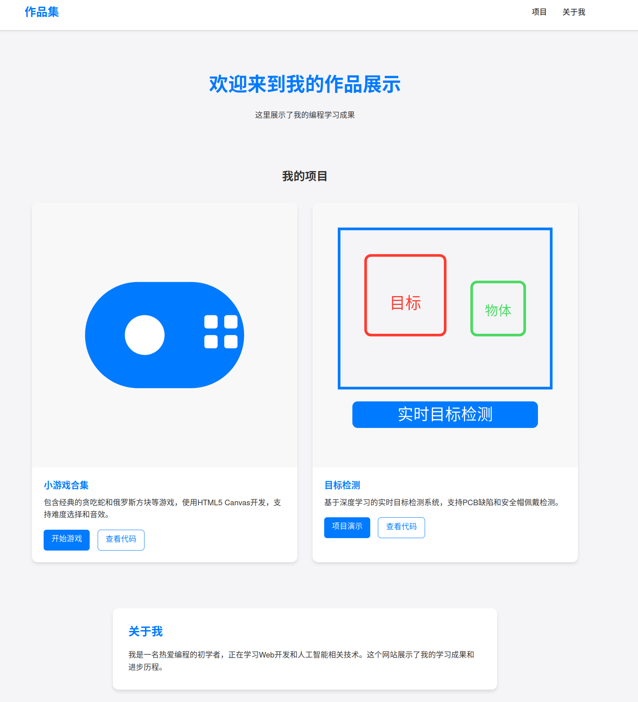

# 个人作品集网站

这是我的个人作品集网站，展示了我的编程学习成果。
  

## 项目列表

### 1. 小游戏合集
- 包含经典的贪吃蛇和俄罗斯方块等游戏
- 使用HTML5 Canvas开发
- 支持难度选择和音效
- 响应式设计

### 2. 目标检测项目（开发中）
- 基于PaddlePaddle框架的实时目标检测系统，支持PCB缺陷和安全帽佩戴检测。

## 技术栈
- HTML5
- CSS3
- JavaScript
- Canvas

## 如何运行

1. 克隆仓库
2. 下载paddle模型,放到detection目录下:
链接: https://pan.baidu.com/s/1QfRz8V2NKK35Uj4GfKuhfw?pwd=dpzb 提取码: dpzb
3. 安装依赖:pip install -r requirements.txt (建议新建一个虚拟环境)
4. 在主文件目录下打开终端进入虚拟环境然后运行:xdg-open index.html

## 更新计划
- [ ] 添加更多项目展示
- [ ] 优化移动端体验
- [ ] 添加深色模式 
